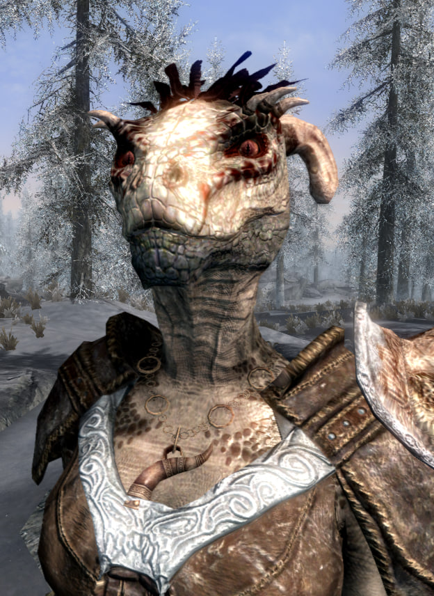
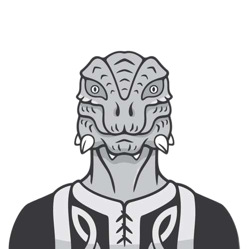
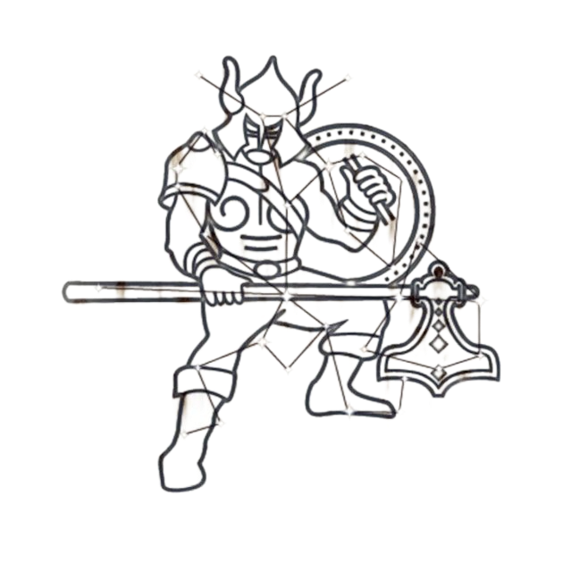

# InfoAroundMe
Information that I would like to share or save in one form or another

# 🎮 MySteamAcc

**Username:** myangel  
**Steam ID:** 76561199216268050  
**Profile:** [SteamDB Calculator](https://steamdb.info/calculator/76561199216268050/?cc=us)

<table>
<tr>
<td colspan="2"><strong>Основная информация</strong></td>
</tr>
<tr>
<td><strong>Уровень аккаунта</strong></td>
<td>45 (356 / 500 XP до следующего уровня)</td>
</tr>
<tr>
<td><strong>Всего XP</strong></td>
<td>12,856 XP</td>
</tr>
<tr>
<td><strong>Регион</strong></td>
<td>RU</td>
</tr>
<tr>
<td><strong>Возраст аккаунта</strong></td>
<td>4.2 years</td>
</tr>
<tr>
<td colspan="2"><strong>💰 Стоимость и финансы</strong></td>
</tr>
<tr>
<td><strong>Стоимость аккаунта (Lowest prices)</strong></td>
<td>$888</td>
</tr>
<tr>
<td><strong>Стоимость аккаунта (Today's prices)</strong></td>
<td>🇺🇸 $3,666</td>
</tr>
<tr>
<td><strong>Средняя цена игры</strong></td>
<td>$16.81</td>
</tr>
<tr>
<td><strong>Средняя цена за час</strong></td>
<td>$0.36</td>
</tr>
<tr>
<td><strong>Потрачено на сыгранные игры</strong></td>
<td>$653</td>
</tr>
<tr>
<td><strong>Потрачено на несыгранные игры</strong></td>
<td>$221</td>
</tr>
<tr>
<td><strong>Потрачено на другие продукты</strong></td>
<td>$13</td>
</tr>
<tr>
<td colspan="2"><strong>⏱️ Время в играх</strong></td>
</tr>
<tr>
<td><strong>Всего времени в играх</strong></td>
<td>8,495.1h</td>
</tr>
<tr>
<td><strong>В платных играх</strong></td>
<td>2,368.1h (27.9%)</td>
</tr>
<tr>
<td><strong>В бесплатных играх</strong></td>
<td>2,069.9h (24.4%)</td>
</tr>
<tr>
<td><strong>В демо-версиях</strong></td>
<td>17.3h (0.2%)</td>
</tr>
<tr>
<td><strong>В других продуктах</strong></td>
<td>4,039.8h (47.6%)</td>
</tr>
<tr>
<td><strong>Среднее время на игру</strong></td>
<td>60.2h</td>
</tr>
<tr>
<td colspan="2"><strong>🎮 Игры</strong></td>
</tr>
<tr>
<td><strong>Всего игр</strong></td>
<td>293</td>
</tr>
<tr>
<td><strong>Сыграно игр</strong></td>
<td>141 (48%)</td>
</tr>
<tr>
<td><strong>Не сыграно</strong></td>
<td>152</td>
</tr>
<tr>
<td colspan="2"><strong>📊 Распределение по времени</strong></td>
</tr>
<tr>
<td><strong>25+ часов</strong></td>
<td>31 игра</td>
</tr>
<tr>
<td><strong>12-25 часов</strong></td>
<td>17 игр</td>
</tr>
<tr>
<td><strong>6-12 часов</strong></td>
<td>9 игр</td>
</tr>
<tr>
<td><strong>3-6 часов</strong></td>
<td>24 игры</td>
</tr>
<tr>
<td><strong>2-3 часа</strong></td>
<td>17 игр</td>
</tr>
<tr>
<td><strong>1-2 часа</strong></td>
<td>9 игр</td>
</tr>
<tr>
<td><strong>0-1 час</strong></td>
<td>34 игры</td>
</tr>
<tr>
<td><strong>Никогда не играл</strong></td>
<td>152 игры</td>
</tr>
<tr>
<td colspan="2"><strong>🏆 Топ-10 игр по времени</strong></td>
</tr>
<tr>
<td><strong>1. Soundpad</strong></td>
<td>1,704.3h | $4.99 | 94.56%</td>
</tr>
<tr>
<td><strong>2. OBS Studio</strong></td>
<td>805.3h | Free | 93.46%</td>
</tr>
<tr>
<td><strong>3. Grand Theft Auto V Legacy</strong></td>
<td>540.2h | No Price | 87.05%</td>
</tr>
<tr>
<td><strong>4. Wallpaper Engine</strong></td>
<td>510.1h | $4.99 | 97.27%</td>
</tr>
<tr>
<td><strong>5. PUBG: BATTLEGROUNDS</strong></td>
<td>482.4h | Free | 59.91%</td>
</tr>
<tr>
<td><strong>6. AniCursor</strong></td>
<td>458.8h | $1.59 | 80.44%</td>
</tr>
<tr>
<td><strong>7. Counter-Strike 2</strong></td>
<td>391.0h | Free | 86.04%</td>
</tr>
<tr>
<td><strong>8. Bongo Cat</strong></td>
<td>327.8h | Free | 96.13%</td>
</tr>
<tr>
<td><strong>9. ShareX</strong></td>
<td>271.0h | Free | 92.62%</td>
</tr>
<tr>
<td><strong>10. tModLoader</strong></td>
<td>200.0h | Free | 96.13%</td>
</tr>
<tr>
<td colspan="2"><strong>🎖️ Значки</strong></td>
</tr>
<tr>
<td><strong>Специальные значки</strong></td>
<td>16</td>
</tr>
<tr>
<td><strong>Обычные значки</strong></td>
<td>52</td>
</tr>
<tr>
<td><strong>Всего уровней значков</strong></td>
<td>52</td>
</tr>
<tr>
<td colspan="2"><strong>🔒 Статус аккаунта</strong></td>
</tr>
<tr>
<td><strong>Game Bans</strong></td>
<td style="color: #7CCE14;">✓ In good standing</td>
</tr>
<tr>
<td><strong>VAC Bans</strong></td>
<td style="color: #7CCE14;">✓ In good standing</td>
</tr>
<tr>
<td><strong>Community Ban</strong></td>
<td style="color: #7CCE14;">✓ In good standing</td>
</tr>
<tr>
<td><strong>Trade Ban</strong></td>
<td style="color: #7CCE14;">✓ In good standing</td>
</tr>
</table>

# 🎯 GameHuntrix

### NieR Replicant ver.1.22474487139...

[ Additional Files](https://github.com/danceqqq/InfoAroundMe/tree/main/sofiles/nieroreplica)

#### Достижения

| Достижение | Описание | Редкость | Дата получения |
|------------|----------|----------|----------------|
|  **All Aboared!** | You rode a boar for at least five minutes. | 7.2% игроков | 30 янв в 8:39 |
|  **Combo Fanatic** | You pulled off a 50-hit combo. | 63.9% игроков | 28 янв в 7:24 |
|  **Combo Master** | You pulled off a 100-hit combo. | 35.0% игроков | 29 янв в 8:16 |
|  **The Book of Legend** | Grimoire Weiss joined your party. | 80.4% игроков | 28 янв в 9:49 |
|  **The Wild Companion** | Kainé joined your party. | 62.5% игроков | 30 янв в 9:03 |
|  **Village Handyman** | You completed 10 quests. | 50.9% игроков | 29 янв в 11:53 |

### The Elder Scrolls V: Skyrim Special Edition

<table>
<tr>
<td rowspan="9" style="text-align: center; vertical-align: top; padding-right: 30px; min-width: 250px; width: 250px;">

</td>
<td colspan="2" style="text-align: center;"><strong>Сборка</strong></td>
</tr>
<tr>
<td><strong>Название</strong></td>
<td>RFAB (Skyrim Requiem for a Balance)</td>
</tr>
<tr>
<td><strong>Логотип</strong></td>
<td></td>
</tr>
<tr>
<td><strong>Версия</strong></td>
<td>RFAB от 27.01.2026</td>
</tr>
<tr>
<td colspan="2" style="text-align: center;"><strong>Персонаж</strong></td>
</tr>
<tr>
<td><strong>Имя персонажа</strong></td>
<td>Рикатурл</td>
</tr>
<tr>
<td><strong>Раса</strong></td>
<td style="vertical-align: middle;"> Аргонианин</td>
</tr>
<tr>
<td><strong>Сложность</strong></td>
<td style="vertical-align: middle;"> Довакин</td>
</tr>
<tr>
<td><strong>Камень Хранитель</strong></td>
<td style="vertical-align: middle;"> Воин</td>
</tr>
</table>

## osu!

### osu! (Official Server)

<table>
<tr>
<td rowspan="22" style="text-align: center; vertical-align: top; padding-right: 30px; min-width: 300px; width: 300px;">

</td>
<td colspan="2"><strong>Рейтинг</strong></td>
</tr>
<tr>
<td><strong>Рейтинг в мире</strong></td>
<td>#379 185 <small>(44 дня назад: #594 911)</small></td>
</tr>
<tr>
<td><strong>Рейтинг в стране</strong></td>
<td>#18 126</td>
</tr>
<tr>
<td colspan="2"><strong>Основная статистика</strong></td>
</tr>
<tr>
<td><strong>Медалей</strong></td>
<td>24</td>
</tr>
<tr>
<td><strong>pp (Performance Points)</strong></td>
<td>2 415</td>
</tr>
<tr>
<td><strong>Времени в игре</strong></td>
<td>1d 4h 47m</td>
</tr>
<tr>
<td colspan="2"><strong>Детальная статистика</strong></td>
</tr>
<tr>
<td><strong>Рейтинговые очки</strong></td>
<td>444 775 955</td>
</tr>
<tr>
<td><strong>Точность попаданий</strong></td>
<td>89.72%</td>
</tr>
<tr>
<td><strong>Количество игр</strong></td>
<td>1 978</td>
</tr>
<tr>
<td><strong>Всего очков</strong></td>
<td>1 860 512 692</td>
</tr>
<tr>
<td><strong>Всего попаданий</strong></td>
<td>448 909</td>
</tr>
<tr>
<td><strong>Попаданий в среднем за игру</strong></td>
<td>226</td>
</tr>
<tr>
<td><strong>Максимальное комбо</strong></td>
<td>647</td>
</tr>
<tr>
<td><strong>Просмотров записей игр другими</strong></td>
<td>0</td>
</tr>
<tr>
<td colspan="2"><strong>Ранги</strong></td>
</tr>
<tr>
<td style="vertical-align: middle;">

<strong>SS (Silver)</strong>
</td>
<td style="text-align: center; font-weight: bold;">0</td>
</tr>
<tr>
<td style="vertical-align: middle;">

<strong>SS (Gold)</strong>
</td>
<td style="text-align: center; font-weight: bold;">0</td>
</tr>
<tr>
<td style="vertical-align: middle;">

<strong>S (Silver)</strong>
</td>
<td style="text-align: center; font-weight: bold; color: #D4A574;">2</td>
</tr>
<tr>
<td style="vertical-align: middle;">

<strong>S (Gold)</strong>
</td>
<td style="text-align: center; font-weight: bold; color: #D4A574;">1</td>
</tr>
<tr>
<td style="vertical-align: middle;">

<strong>A</strong>
</td>
<td style="text-align: center; font-weight: bold; color: #D4A574;">30</td>
</tr>
</table>

### osu! Akatsuki

<table>
<tr>
<td rowspan="25" style="text-align: center; vertical-align: top; padding-right: 30px; min-width: 300px; width: 300px;">

</td>
<td colspan="2"><strong>Топ-3 рекорда</strong></td>
</tr>
<tr>
<td colspan="2" style="padding: 8px; vertical-align: middle;">
<table style="width: 100%; border-collapse: collapse;">
<tr style="background: #f5f5f5;">
<td style="padding: 10px; width: 80px; vertical-align: middle;">

</td>
<td style="padding: 10px; vertical-align: middle;">
<strong>Ne Obliviscaris - Songs Compilation [Through the Mist of Time the Crimson Hands Weave a World That Never Was]</strong> 
<small>1,121,750 / 797x / HDDTRX</small> 
<strong style="color: #D4A574;">1,141pp</strong> | <strong>Accuracy: 96.31%</strong>
</td>
</tr>
</table>
</td>
</tr>
<tr>
<td colspan="2" style="padding: 8px; vertical-align: middle;">
<table style="width: 100%; border-collapse: collapse;">
<tr style="background: #f5f5f5;">
<td style="padding: 10px; width: 80px; vertical-align: middle;">

</td>
<td style="padding: 10px; vertical-align: middle;">
<strong>Joyce Manor - NBTSA (Sped Up Ver.) [can i tell you a secret]</strong> 
<small>86,030 / 165x / HDDTRX</small> 
<strong style="color: #D4A574;">924pp</strong> | <strong>Accuracy: 95.46%</strong>
</td>
</tr>
</table>
</td>
</tr>
<tr>
<td colspan="2" style="padding: 8px; vertical-align: middle;">
<table style="width: 100%; border-collapse: collapse;">
<tr style="background: #f5f5f5;">
<td style="padding: 10px; width: 80px; vertical-align: middle;">

</td>
<td style="padding: 10px; vertical-align: middle;">
<strong>VINXIS - Sidetracked Day [Infinity Inside]</strong> 
<small>571,590 / 1,360x / HDDTRX</small> 
<strong style="color: #D4A574;">893pp</strong> | <strong>Accuracy: 99.07%</strong>
</td>
</tr>
</table>
</td>
</tr>
<tr>
<td colspan="2"><strong>Рейтинг</strong></td>
</tr>
<tr>
<td><strong>Глобальный рейтинг</strong></td>
<td>#1,043</td>
</tr>
<tr>
<td><strong>Peak global rank</strong></td>
<td>#1,033 on 20 Jan 2026</td>
</tr>
<tr>
<td><strong>Рейтинг по стране</strong></td>
<td>#164</td>
</tr>
<tr>
<td colspan="2"><strong>Основная статистика</strong></td>
</tr>
<tr>
<td><strong>PP</strong></td>
<td>14,685</td>
</tr>
<tr>
<td><strong>Рейтинговый счет</strong></td>
<td>77,567,160</td>
</tr>
<tr>
<td><strong>Общий счет</strong></td>
<td>408,176,540</td>
</tr>
<tr>
<td><strong>Сыграно карт</strong></td>
<td>3,242</td>
</tr>
<tr>
<td><strong>Playtime</strong></td>
<td>2d 9h 32m</td>
</tr>
<tr>
<td><strong>Просмотрено повторов</strong></td>
<td>1</td>
</tr>
<tr>
<td><strong>Всего попаданий</strong></td>
<td>1,358,028</td>
</tr>
<tr>
<td><strong>Точность</strong></td>
<td>95.77%</td>
</tr>
<tr>
<td><strong>Max combo</strong></td>
<td>1,777</td>
</tr>
<tr>
<td><strong>Followers</strong></td>
<td>2</td>
</tr>
<tr>
<td colspan="2"><strong>Ранги</strong></td>
</tr>
<tr>
<td style="vertical-align: middle;">

<strong>SS (Silver)</strong>
</td>
<td style="text-align: center; font-weight: bold;">0</td>
</tr>
<tr>
<td style="vertical-align: middle;">

<strong>SS (Gold)</strong>
</td>
<td style="text-align: center; font-weight: bold;">0</td>
</tr>
<tr>
<td style="vertical-align: middle;">

<strong>S (Silver)</strong>
</td>
<td style="text-align: center; font-weight: bold; color: #D4A574;">28</td>
</tr>
<tr>
<td style="vertical-align: middle;">

<strong>S (Gold)</strong>
</td>
<td style="text-align: center; font-weight: bold; color: #D4A574;">1</td>
</tr>
<tr>
<td style="vertical-align: middle;">

<strong>A</strong>
</td>
<td style="text-align: center; font-weight: bold; color: #D4A574;">176</td>
</tr>
</table>